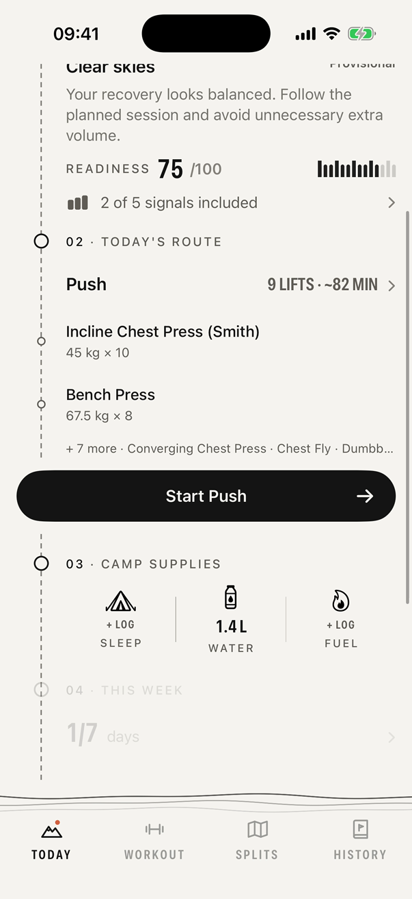
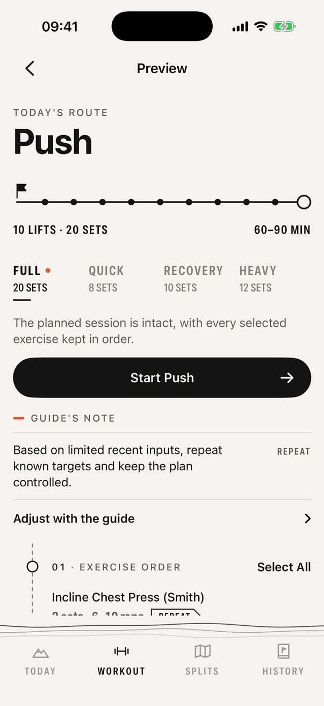
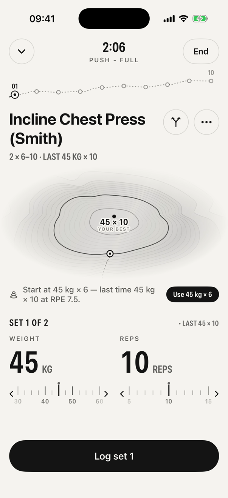
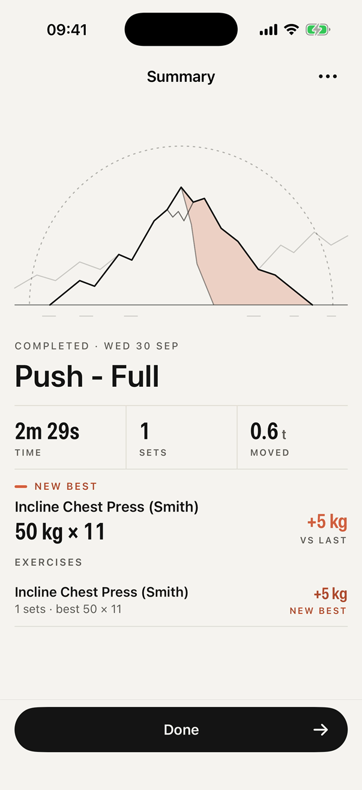
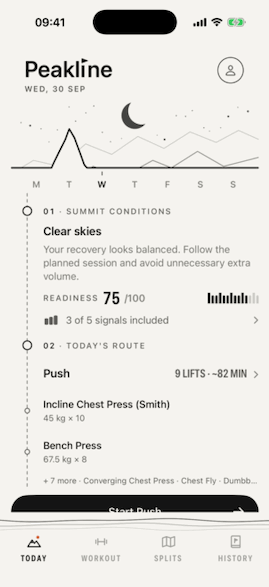
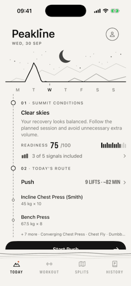
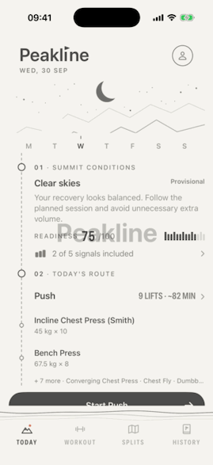
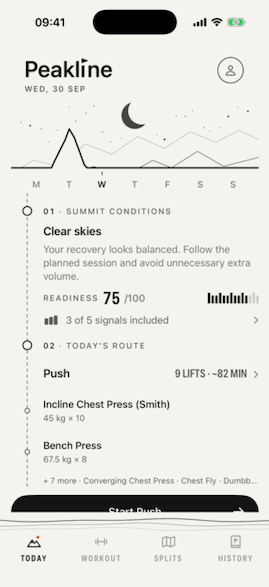

# Peakline

**A calm, local-first iOS lifting coach. Plan the climb, log the route, review the summit.**


<p align="center">
  <a href="https://github.com/noelpat-dev/peakline-showcase/releases/download/promo-v1/peakline-promo-16x9.mp4"></a>
</p>
<p align="center"><sub><b>The 15-second promo.</b> Every logged set draws one contour of the map. The last set is a new best, so the summit takes the alpenglow and the map rises into the mountain you climbed. Drawn entirely in code and rendered frame by frame. Watch the full-quality MP4 in <a href="https://github.com/noelpat-dev/peakline-showcase/releases/download/promo-v1/peakline-promo-16x9.mp4">16:9</a> or <a href="https://github.com/noelpat-dev/peakline-showcase/releases/download/promo-v1/peakline-promo-9x16.mp4">9:16 vertical</a>.</sub></p>

<p align="center">
  
  
  
  
</p>

> This is the public showcase for Peakline, an iOS app I've been designing and building since May 2026. The full source (500+ commits, about 120k lines of Swift, 1,000+ unit tests) lives in a private repository. This page shows the product, how it's built, and a handful of representative source files. **If you're reviewing my work for a role, I'm happy to give you read access to the full repository. [Get in touch through GitHub](https://github.com/noelpat-dev).**

## Watch the demo

**[▶ Watch the full walkthrough (about 4 minutes, MP4)](https://github.com/noelpat-dev/peakline-showcase/releases/download/v1.0/peakline-demo.mp4)**. It's recorded on the iPhone 17 simulator with synthetic demo data (six weeks of Push/Pull/Legs), never personal training data.

Or skim the parts that interest you (each clip loops, played faster than real time):

| | |
| --- | --- |
| **Today** | **Workout Preview** |
|  |  |
| The day as a trail: summit conditions and readiness, today's route, camp supplies (sleep, water, fuel), the week and your altitude. | The session as a route line. Switch Full, Quick or Recovery and the trail changes length. Each exercise row has one control for its grip and actions. |
| **Live logger** | **Today's route** |
|  |  |
| One exercise on a contour map. Adjust the weight and reps scales, log the set, and a new best is flagged. Rest runs as a sun crossing the sky, then hands straight over to the next exercise. | The whole session at a glance, with “start this one now” when a machine is free. |
| **Finish and Sundown** | **History** |
|  |  |
| Finish early without losing track of what was skipped, rate the climb, and see the summary with its new bests. | A month ridge with PR flags, attendance, highlights, and an editable session detail with inline Repeat and Save as template. |
| **Coach and Progress** | **Sleep and recovery** |
|  |  |
| Explainable guidance (“Push as planned today”, with the evidence and its confidence), progress charts and a PR timeline. | Overnight history, sleep window, naps and the guide's notes, feeding readiness. |
| **Splits** | **Privacy and backup** |
|  |  |
| The active programme and its training days, with per-exercise targets you can edit. | Local-first by default. The optional encrypted backup is explained in plain language, and there's a Lock Screen details switch. |

## What makes Peakline different

Most workout apps are spreadsheets with a feed attached. Peakline treats a training session as a route you walk, and keeps everything else out of the way.

- **One visual language, end to end.** The whole app is drawn in "Summit": ink on warm paper, contour lines, trail maps and a few calm, one-shot motions. Today is a trail through your day, the workout preview is a route whose length follows the session mode, the live logger climbs a contour, the rest timer is a sun crossing the sky, and a finished workout ends at "Sundown". A warm alpenglow accent is kept for real achievements only.
- **Coaching you can explain.** Recommendations, progression targets and readiness come from deterministic, tested rules on the device, not a remote model. The app shows the evidence it used and says when it doesn't know.
- **Built for the gym floor.** Logging a set is two scale adjustments and one tap. Rest opens by itself after an exercise's last set and hands straight over to the next exercise. A Live Activity keeps the current exercise and rest on the Lock Screen. The layout never jumps while you're mid-set.
- **Your data stays yours.** SwiftData on the device is the source of truth, so everything works offline. The optional cloud backup is encrypted on the phone before upload with a generated recovery key, so the server only ever sees ciphertext.
- **Honest about health data.** HealthKit, barcode lookup and label scanning are optional imports that you review before anything is saved, and the app degrades gracefully when they're unavailable.

## How it works

Peakline is built around one loop:

| 1. Decide | 2. Preview | 3. Log | 4. Review |
| --- | --- | --- | --- |
| **Today** reads readiness, sleep, hydration and your rotation, and suggests the next session with its reasons. | **Workout Preview** shows the route: exercises, targets from your last best sets, and a duration range calibrated from your history. Switch Full, Quick, Recovery or Heavy and the trail changes length. Reorder by dragging. | **The live logger** is one exercise at a time on a contour map: adjust weight and reps on scales, log the set, rest under the sun, and see today's whole route whenever you need it, with "start this one now" when a machine is free. | **Sundown** summarises the session and new bests. **History** keeps a month ridge, attendance, highlights and editable sessions; **Progress** charts best sets, estimated 1RM and a PR timeline. The next target comes from here. |

Around the loop: editable Push/Pull/Legs/Upper/Lower rotations (**Splits**), an offline **Exercise Guide** with 302 illustrated movements, **Sleep & recovery** with overnight history, naps and an optional HealthKit bridge, **hydration** and **nutrition** with barcode and label import, and **Account & Backup** for the encrypted restore.

## Engineering highlights

- **Local-first architecture.** SwiftUI views present state; feature services own the rules (coaching, calculations, imports, exports, backup); SwiftData models are the local source of truth. Performance-sensitive routes prepare immutable, `Sendable` value snapshots before navigating, so screens open on their first frame without walking SwiftData relationships in `body`.
- **Performance as a feature.** A scripted acceptance verifier measures route timing, warm-cache reuse, duplicate refreshes and unsafe synchronous SwiftData access, with explicit budgets.
- **Encrypted backup designed against a real threat model.** Two immutable backup slots per user and a pointer flipped by compare-and-swap in the Firestore security rules, so a half-finished upload can never replace a good backup. There's a one-a-minute write limit that no client can reset, verified-email and recent-sign-in checks enforced server-side, and an authenticated (AES-GCM AAD) header with the record counts inside the ciphertext. Account deletion is resumable and leaves an irreversible tombstone. All of this runs on Firebase's free plan: no Cloud Functions, so the security rules are the server.
- **Security-audited.** A structured 27-finding audit of the backup, account and on-device data paths was worked through in four rounds and re-reviewed until it was signed off, backed by 122 emulator tests of the security rules.
- **Tested where it matters.** 1,000+ unit tests (coaching, workout reliability, backup and restore, migrations, imports) and 115 UI tests covering the main journeys, lifecycle and navigation. GitHub Actions runs the unit suite, a performance smoke test and strict-concurrency diagnostics.
- **Accessible by default.** Dynamic Type-backed typography, 44-point controls, VoiceOver labels and focus handling, and Reduce Motion and Reduce Transparency fallbacks for every animation.

## Architecture

```text
SwiftUI views ─────────── present state, collect input, one Summit design system
      │
Feature services ──────── coaching · targets · readiness · imports/exports · backup · snapshots
      │
SwiftData models ──────── local source of truth (versioned schema + migration plan)
      │
Prepared value snapshots ─ immutable, Sendable, warm-started for instant routes
      │
Optional edges ────────── Firebase Auth + Firestore (encrypted backup) · HealthKit · Live Activity · widgets
```

| Area | Choice |
| --- | --- |
| Platform | iOS 17+, iPhone |
| UI | SwiftUI, Swift Charts, ActivityKit (Live Activity), WidgetKit |
| Persistence | SwiftData with a versioned schema and migration plan |
| Coaching | Deterministic on-device services |
| Backup | Firebase Auth + Cloud Firestore (Spark plan), client-side AES-GCM encryption |
| Health | Optional HealthKit bridge |
| Testing | XCTest unit and UI tests, Firestore emulator rules tests (Node) |
| CI | GitHub Actions on macOS |

## Selected source

A few files from the private repository, chosen to show the engineering approach. They're excerpts, so they won't build on their own.

<!-- SAMPLES -->

## Timeline

- **May 2026:** first commit (14 May) and the core loop: the Push/Pull/Legs tracker, a deterministic coach engine, workout targets and previews, and barcode food logging.
- **June–August:** reliability and performance. That meant prepared route snapshots so screens open instantly, a single motion system, encrypted backup recovery, and shared UI tokens.
- **September:** the Summit redesign of every screen, a rebuilt live-workout logger, a security audit and its remediation, and final polish. That's 450+ commits in the month.

## Licence

© 2026 Noel Patricks. **All rights reserved.** This repository is shared so people can see my work. It is not open source: no licence is granted to copy, modify or redistribute the code, media or designs. See [LICENSE](LICENSE).

Exercise artwork shown in the demo comes from third-party sources under CC BY-SA 4.0; see [THIRD_PARTY_NOTICES.md](THIRD_PARTY_NOTICES.md).
